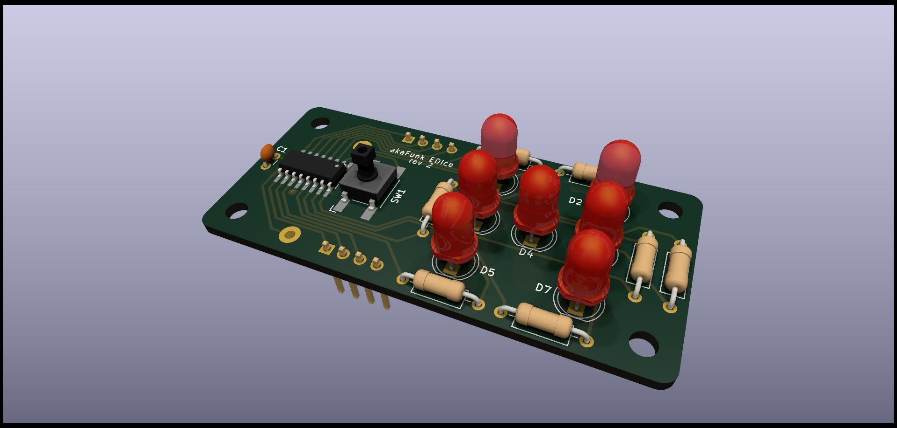

# EDice
The EDice is a small and fairly simple device that simulates a dice by using some LEDs, resistors and a microcontroller. The controller used is a Padauk PFS154-S16, which is an extremly cheap 8 bit microcontroller. It can be purchased from LCSC and other sources for less than 10 Euro-Cents.

The EDice is used as a simple soldering exercise. Therefore it has a combination of (relatively large) SMD and through-hole parts.

It is powered by a single CR2032 3V coin cell, which is on the back of the PCB. The holder we use is the BS-02-A1AJ010, which can also be purchased from LCSC for less than 5 Euro-Cents a pop.

Together with the PCB and a few other components, the whole cost is approximately 1€ in quantaties of about 100. This includes everything except the prommer (PCB, components, 3D case, shipping), which makes it ideal for a give-away item.

## Building
Building is pretty straight forward. A few things to note:
- Do not have a battery in the EDice while having it plugged into the prommer.
- The resistor values are quite flexible, depending on the LEDs you choose. However, the maximum source current of the microcontroller is 1.6mA on each pin. So a value of 1k or higher should be used. 1k is pretty bright though.

## BOM
We used LCSC for component sourcing. Here is our list:

- 100x microcontroller, PFS154-S16, C317613
- 100x battery holder, BS-02-A1AJ010, C5239862
- 100x button, K2-1102DP-J4SW-04, C136680
- 20x pin header,  12251140CNG0S115001,  C429959
- 700x 1k resistor, CR1/4W-1K±5%-ST26, C2894606
- 100x 100nF ceramic capacitor, CC1H104ZC1FD3F5O1100, C2832508
- 700x red LED 5mm,  XL-502SURD, C2895492

There are probably cheaper things out there, we did not look to hard into it.

## Programming
To program the Padauk microcontroller you need a Free-PDK prommer: https://free-pdk.github.io/

You also need to install the SDCC compiler.

Connect the EDice to the prommer (WITHOUT A BATTERY!) and run:

`make clean program run`

With the `run` command, the prommer will power the EDice and it should work right away.

## Using
Hold the button for a few seconds to roll the dice. A short press or waiting for ~20 seconds will put it in power-down mode, consuming less than 0.1µA. The battery should last for years.

## Cost
Hers is a short breakdown of the cost for 100 pcs:

- PCB at JLCPCB with shipping: 30€
- Components at LCSC with free/combined shipping (place PCB order first!): 34€
- CR2032 batteries from eBay/Amazon: 20€
- Material for 3D printing (1200g PLA): 25€

The total cost is then 99€ for 100 pcs.

This does not include the cost for the prommer, which are an additional ~25€.

## TODO
- Create a small adapter PCB for the prommer to fit into the EDice. A piece of breadboard and some pin headers will also do the trick.
- Switch the LED structure so that the controller pulls them down to turn them on. This increases the current handling from 1.6mA to 6mA.

## License
The PCB and the images are licensed under CC-BY 4.0, the source code is under GPL v2.

For the PCB we used the KiCad symbols made by the free-pdk project: https://github.com/free-pdk/pdk-kicad-symbols/tree/master. This library is licensed under the CC-BY 4.0.

For the software the pdk-includes (GPL v2) https://github.com/free-pdk/pdk-includes and the easy-pdk-includes (GPL v2)  https://github.com/free-pdk/easy-pdk-includes are used.

## Images

